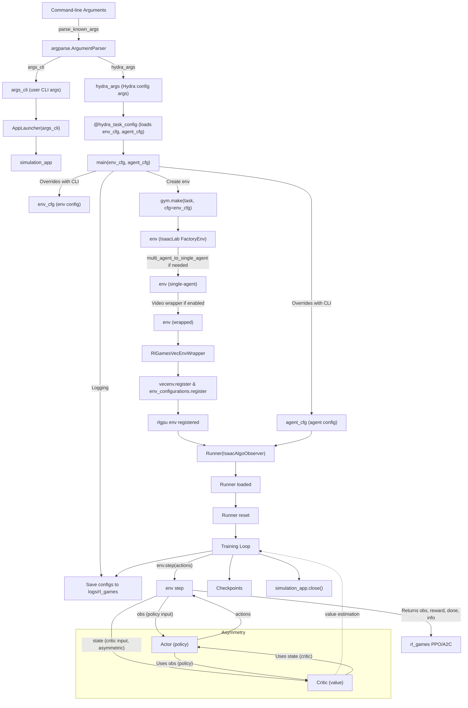

```mermaid
flowchart TD
    %% Command-line and Hydra argument flow
    CLI["Command-line Arguments"] -->|parse_known_args| PARSER["argparse.ArgumentParser"]
    PARSER -->|args_cli| ARGS_CLI["args_cli (user CLI args)"]
    PARSER -->|hydra_args| HYDRA_ARGS["hydra_args (Hydra config args)"]

    %% App launch
    ARGS_CLI --> APP_LAUNCHER["AppLauncher(args_cli)"]
    APP_LAUNCHER --> SIM_APP["simulation_app"]

    %% Hydra config loading
    HYDRA_ARGS --> HYDRA_TASK_CONFIG["@hydra_task_config (loads env_cfg, agent_cfg)"]
    HYDRA_TASK_CONFIG --> MAIN_FN["main(env_cfg, agent_cfg)"]

    %% Main training function
    MAIN_FN -->|Overrides with CLI| ENV_CFG["env_cfg (env config)"]
    MAIN_FN -->|Overrides with CLI| AGENT_CFG["agent_cfg (agent config)"]
    MAIN_FN -->|Logging| LOGGING["Save configs to logs/rl_games"]
    MAIN_FN -->|Create env| GYM_MAKE["gym.make(task, cfg=env_cfg)"]
    GYM_MAKE --> ENV["env (IsaacLab FactoryEnv)"]
    ENV -->|multi_agent_to_single_agent if needed| ENV_SINGLE["env (single-agent)"]
    ENV_SINGLE -->|Video wrapper if enabled| ENV_WRAPPED["env (wrapped)"]
    ENV_WRAPPED --> RL_GAMES_VECENV["RlGamesVecEnvWrapper"]

    %% RL-Games registration
    RL_GAMES_VECENV --> RL_REG["vecenv.register & env_configurations.register"]
    RL_REG --> RL_ENV["rlgpu env registered"]

    %% Training loop
    RL_ENV --> RUNNER["Runner(IsaacAlgoObserver)"]
    AGENT_CFG --> RUNNER
    RUNNER --> RUNNER_LOADED["Runner loaded"]
    RUNNER_LOADED --> RUNNER_RESET["Runner reset"]
    RUNNER_RESET --> TRAIN_LOOP["Training Loop"]
    TRAIN_LOOP -- "env.step(actions)" --> ENVSTEP
    ENVSTEP["env step"]
    ENVSTEP -- "Returns obs, reward, done, info" --> RL_GAMES["rl_games PPO/A2C"]

    %% Observation/state flow
    ENVSTEP -- "obs (policy input)" --> ACTOR["Actor (policy)"]
    ENVSTEP -- "state (critic input, asymmetric)" --> CRITIC["Critic (value)"]
    ACTOR -- "actions" --> ENVSTEP
    CRITIC -.->|"value estimation"| TRAIN_LOOP

    %% Logging and checkpointing
    TRAIN_LOOP --> LOGGING
    TRAIN_LOOP --> CHECKPOINT["Checkpoints"]

    %% End
    TRAIN_LOOP --> SIM_APP_CLOSE["simulation_app.close()"]

    %% Notes
    subgraph Asymmetry
        ACTOR -- "Uses obs (policy)" --> CRITIC
        CRITIC -- "Uses state (critic)" --> ACTOR
    end
```